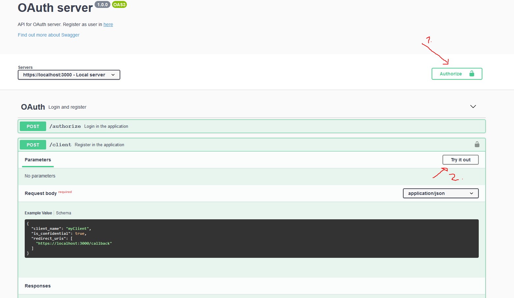

# OAuth 2.0 server with authorization code flow

Repository includes OAuth 2.0 server with authorization code flow. Server is implemented as  course work for COMP.SEC.300 Secure programming course. Application is work in progress.

## Requirements

- Docker 18.06.0+

OR

- Node 14.16.0+
- MongoDB 4.4.4+ running on your computer

## How to set up

Application expects repository to include self signed certificate for HTTPS. Run following command to generate certificate:

- *openssl req -x509 -newkey rsa:4096 -keyout key.pem -out cert.pem -days 365*

Create *.env* file. Required fields are in *.env.example*

Run following command to run the system with **docker**:

- *docker compose up* to start MongoDB and server with docker

Run system **locally**

- *npm install* to install dependencies

- *npm run dev* to start development server **or** *npm run prod* to start production server

Server runs in https://localhost:3000

## How to use

There is 2 views in this application: Authorize and Register. 

- Authorize is located in https://localhost:3000/authorize. Used to log in as user or to authorize clients
- Register is located in https://localhost:3000/register. Used to register new users

There is also REST-endpoint which can be seen from https://localhost:3000/docs

### Flow to get access token with client authorization

1. Create user in https://localhost:3000/register
2. Authenticate with new user in https://localhost:3000/authorize which will return access token
3. Use access token as Bearer in authorization-header and post to /client to generate client. Check https://localhost:3000/docs and picture below for help

4. Use returned *client_id*, *redirect_uri* and *response_type=code*, and optionally *state* and *scope* parameters to start authorization with client (Example https://localhost:3000/authorize?client_id=005956ea-8851-44a1-89c7-2eda997f3afe&redirect_uri=https://localhost:3000/callback&scope=profile:read&response_type=code). Check further documentation for required and optional parameters.
5. Log in with previously created user. 
6. Use returned code, *client_id*, *client_secret* from **point 3** and *redirect_uri* which was used for request in **point 4** to post to /token-endpoint. Check scheme **ConfidentialTokenRequest** from https://localhost:3000/docs
7. Use returned endpoint to access secured endpoints. Check Secure-enpoints from https://localhost:3000/docs. Access depends on required scopes. Get can be used if *profile:read* is required, Post can be used if *profile:write*

## Further documentation

Read further documentation from [here](documentation/documentation.md). Documentation includes introduction to codebase, security considerations and instruction on how to use the system.