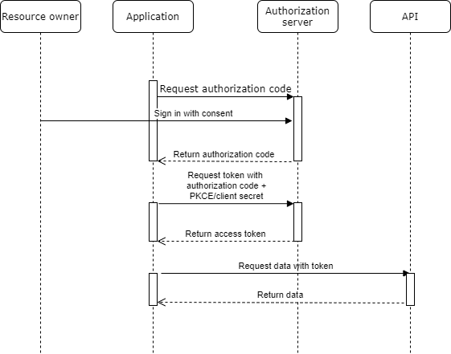

# OAuth 2.0 server with authorization code flow

## How to set up
Application expects repository to include self signed certificate for HTTPS. Run following command to generate certificate:

- *openssl req -x509 -newkey rsa:4096 -keyout key.pem -out cert.pem -days 365*

Run following command to run the system:

- *docker-compose up*

## Introduction

This repository includes simple OAuth 2.0 server with authorization code flow. Application includes login page which asks permission from user to give third-party application access to specific scopes. Client must be registered to ask access, but currently dynamic client registration is not included.

In this repository, Authorization code flow for OAuth is implemented. Flow is implemented for confidential clients with client secret and public clients with PKCE ([Proof Key for Code Exchange](https://oauth.net/2/pkce/)). Implemente flow is shown in diagram below.

Currently dynamic client registration is not implemented as this repository as this repository is used only to illustrate authorization code flow. Dummy clients are added when server is started but clients could be added straight to database if needed.

When client is registered, following properties are required.

- redirectUris. These include all redirectUris that could be used when requesting authorization code for this client
- confidential. Is client confidential or not. This is used to determine if PKCE or client secret should be user
- clientSecret. If client is confidential, client secret should be added

Flow starts with application requesting authorization code flow. In this stage, user agent (browser such as Chrome) is redirected to authorization servers log in screen. Query parameters must include *redirect_uri*, *response_type* and _client_id_. If client is public, PKCE specific *code_challenge* is required and* code_challenge_method*is optional. Optional parameters are*scope*, *state*.

- _redirect_uri_ is uri where user agent is redirected after erronous or successful authorization.
- _response_type_ is used to tell authorization server, which grant type is executed. **Only code is supported** (code stands for authorization code flow).
- _client_id_ is id which is assigned to client on registration.
- _code_challenge_ is dynamically generated code in application. Should be cryptographically random string.
- _code_challenge_method_ has either value _plain_ or _s256_. This depends on if code challenge is SHA256 hash of the string or plain string. If code\*challenge*method is omitted, server will assume it to be \_plain*
- *scope* is scope which application will get access to users data.
- *state* is random string which is used to prevent CSRF attacks. Authorization server returns state back unmodified.

Example. https://localhost:3000/authorize?client_id=f461489a-a604-4cb6-a1e7-98a01eee1d66&response_type=code&scope=profile&code_challenge=abc&code_challenge_method=s256&redirect_uri=http://localhost:3000/callback

If user signs in with correct username and password, user agent is redirected back to given redirect uri with authorization_code as uri parameter. If user cancels request, agent is redirected back to redirect uri with error-response.

Example. http://localhost:3000/callback?code=108788d45bb5c0e40374c30911bc169fb83548c1df9f7c2037ecc7413e9e0fdc

Authorization code is used to obtain access token. Access token request uses JSON-body and it should include following parameters

- *grant_type* **required**. Is used to tell authorization server, which grant type was used for authorization request.http://localhost:3000/callback?code=108788d45bb5c0e40374c30911bc169fb83548c1df9f7c2037ecc7413e9e0fdc
- *code* **required**. Code obtained in authorization-request
- *client_id* **required**. Client which was used to obtain initial authorization code.
- *redirect_uri* **required**. Redirect uri which was used in initial authorization-request.
- *code_verifier* **required if code_challenge was used**. Original code before encryption.
- *client_secret* **required if confidential client**. Client secret which was added to client on creation.

If parameters are correct. Access token is returned to user with specific lifetime. Access token can be used to fetch data from API.

## Structure of the program

Program is made with Node.js, Express.js and Handlebars as template-engine. Source-code is located in src-folder.

### controllers

Controllers include routing to specified urls with business logic attached to them. Routes are connected in index.ts and business logic is located in files Authorize, Register, Token.

Authorize handles authorization request validation, authorization code generation and errors for invalid authorization request. Error is shown to user or redirected to original request-site depending on parameter. If redirect_uri or client_id is invalid, error is shown in authorization server with alert. If error occurs in any other parameter, request is redirected to redirect_uri with error message.

Register handles user registration. User is registered with email and password where password is hashed with bcrypt.

Token handles token generation and authorization code validation. If authorization code is valid and valid credentials are given, token is generated and returned to user.

### errors

Errors include all errors which are used to give information to application or user. There is errors which redirect user agent back to requestor site and errors which are shown to user in authorization server log in screen.

### middleware

Middlewares are functions which have access to request- and response object. Usually used as general method before handling request. For example isAuthenticated could be middleware.
### models

Models are data-types which are used to save necessary data to MongoDB-database. There are following models.

- *client* is used to save clients which can request authorization to users data.
- *code* is generated code when authorization is requested and user signs in with consent.
- *scope* is used to limit access to users data. Authorization server can request access to specified scope which is shown to user when signing in.
- *user* is user of this specified service. Client can request users data with users consent.

### setup

Setup is used to set needed initial data to database before first startup. As there is no dynamic client registration, clients are set with setup. Also scopes are set in setup.

### utils

Utils include functions which are used in multiple places. Important. There is following utils-files.

- *errorHandler* include error handling for application.

- *parse* include input validation and parsing

- *settings* include environment variable parsing.

- *utils* include general utility-function.

### views

Views include views for this application. There is following views:

- *authorize* is used to show user sign in screen with specified scope which can be consented or rejected.

- *error* is shown if that specific error should be shown in authorization server

- *register* is shown when new user needs to be registered.

## Secure programming solutions

## Security testing

## Improvements
