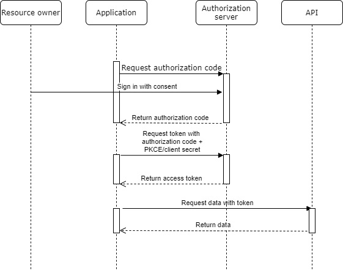
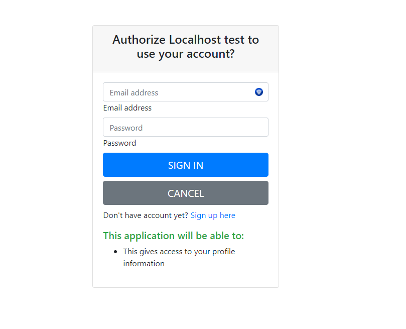

# OAuth 2.0 server with authorization code flow

## Introduction

This repository includes simple OAuth 2.0 server with authorization code flow. Application includes login page which asks permission from user to give third-party application access to specific scopes. Client must be registered to ask access.

In this repository, Authorization code flow for OAuth is implemented. Flow is implemented for confidential clients with client secret and public clients with PKCE ([Proof Key for Code Exchange](https://oauth.net/2/pkce/)). 

Client registration is required to get authorization code from user. When client is registered, following properties are required. Post-request to *https://localhost:3000/client*

- *redirect_uris* **required**. These include all redirect uris that could be used when requesting authorization code for this client
- *is_confidential* **required**. Is client confidential or not. Client secret as authentication method is used for confidential clients and PKCE for public clients.
- *client_name* **required**. Name of the client, will be visible for user when requesting access.

Implemente flow is shown in diagram below.

Flow starts with application requesting authorization code flow. In this stage, user agent (browser such as Chrome) is redirected to authorization servers log in screen. Following parameters should be added to request params.

- _redirect_uri_ **required**. Uri where user agent is redirected after erronous or successful authorization.
- _response_type_ **required**. Used to tell authorization server, which grant type is executed. **Only code is supported**
- _client_id_ **required**. Id which is assigned to client on registration.
- _code_challenge_ **required if client is not confidential**. Dynamically generated code in application. Should be cryptographically random string.
- _code_challenge_method_ **optional**. Either value _plain_ or _s256_. This depends on if code challenge is SHA256 hash of the string or plain string. If *code_challenge_method* is omitted, server will assume it to be *plain*. **If s256 is used, code_challenge must be hashed with s256 and base64-encoded. plain -> sha256 -> base64**
- _scope_ **optional**. Scope which application will get access to users data. Possible values *profile:read* *profile:write*. Defaults to *profile:read*. **Must be separated by empty space or + if using multiple. Example scope=profile:read profile:write**
- _state_ **optional but recommended**. Random string which is used to prevent CSRF attacks. Authorization server returns state back unmodified.

Example. https://localhost:3000/authorize?client_id=f461489a-a604-4cb6-a1e7-98a01eee1d66&response_type=code&scope=profile:read+profile:write&code_challenge=abc&code_challenge_method=plain&redirect_uri=http://localhost:3000/callback

If user signs in with correct username and password, user agent is redirected back to given redirect uri with authorization_code as uri parameter. If user cancels request, agent is redirected back to redirect uri with error-response.

Example. http://localhost:3000/callback?code=108788d45bb5c0e40374c30911bc169fb83548c1df9f7c2037ecc7413e9e0fdc

Authorization code is used to obtain access token. Access token request uses JSON-body and it should include following parameters. Post-request to *https://localhost:3000/token*

- _grant_type_ **required**. Is used to tell authorization server, which grant type was used for authorization request. **Use grant_type=authorization_code**
- _code_ **required**. Code obtained in authorization-request
- _client_id_ **required**. Client which was used to obtain initial authorization code.
- _redirect_uri_ **required**. Redirect uri which was used in initial authorization-request.
- _code_verifier_ **required if public client and code_challenge was used**. Original code before encryption.
- _client_secret_ **required if confidential client**. Client secret which was added to client on creation.

If parameters are correct. Access token is returned to user with specific lifetime. Access token can be used to fetch data from API.

## Structure of the program

Program is made with Node.js, Express.js and Handlebars as template-engine. Source-code is located in src-folder.

### controllers

Controllers include routing to specified urls with business logic attached to them. Routes are connected in index.ts and business logic is located in files Authorize, Register, Token.

Authorize handles authorization request validation, authorization code generation and errors for invalid authorization request. Error is shown to user or redirected to original request-site depending on parameter. If redirect_uri or client_id is invalid, error is shown in authorization server with alert. If error occurs in any other parameter, request is redirected to redirect_uri with error message.

Register handles user registration. User is registered with email and password where password is hashed with bcrypt.

Token handles token generation and authorization code validation. If authorization code is valid and valid credentials are given, token is generated and returned to user.

### errors

Errors include all errors which are used to give information to application or user. There is errors which redirect user agent back to requestor site and errors which are shown to user in authorization server log in screen.

### middleware

Middlewares are functions which have access to request- and response object. Usually used as general method before handling request. For example isAuthenticated could be middleware.

### models

Models are data-types which are used to save necessary data to MongoDB-database. There are following models.

- _client_ is used to save clients which can request authorization to users data.
- _code_ is generated code when authorization is requested and user signs in with consent.
- _scope_ is used to limit access to users data. Authorization server can request access to specified scope which is shown to user when signing in.
- _user_ is user of this specified service. Client can request users data with users consent.

### setup

Setup is used to set needed initial data to database before first startup. Only scopes and admin user are setup here.

### utils

Utils include functions which are used in multiple places. Important. There is following utils-files.

- _errorHandler_ include error handling for application.

- _parse_ include input validation and parsing

- _settings_ include environment variable parsing.

- _utils_ include general utility-function.

- *logger* include logger used to log data to specified location

### views

Views include views for this application. There is following views:

- _authorize_ is used to show user sign in screen with specified scope which can be consented or rejected.

- _error_ is shown if that specific error should be shown in authorization server

- _register_ is shown when new user needs to be registered.

## Secure programming solutions

Following list is used to present vulnerabilities and secure programming solutions to prevent those.

### Injection

Injection is prevented with input validation. Validators are located in _src/utils/parse_ and validators are used to validate all incoming data. As mongodb is used as database, injection could be done for example with _email : { $ne : null}_ which would return all emails which are not null. To prevent this, incoming emails are parsed and checked to be strings before using them.

### Broken authentication

When creating new users, password is checked to include atleast 1 lowercase, 1 uppercase, 1 symbol and length must be atleast 8 letters. However passwords are not checked against well known passwords which means that password could be for example _Password1._ There is no possibility to recover password, which prevents attacks with ineffective credential recovery.

When user registers to this application, password is hashed with bcrypt. In case of data breach, passwords could not be recovered from database. When user logs in, JWT-cookie is assigned and returned which prevents session specific attacks.

This application doesn't prevent brute force or other automated attacks as it doesn't have rate limiter. This could be added in future for example with _node-rate-limiter-flexible_ package.

### Sensitive data exposure

Only sensitive data in this application is passwords and client secrets Bcrypt is used to hash password and client secrets which prevents sensitive data exposure. Client secret is presented to client during registration which should be then saved by client. HTTPS is used which prevents transmission of sensitive data as clear text.

Client side caching is disabled with headers _cache-control=no store_ and _Pragma=no-cache_. These are used to prevent caching response which includes access tokens. Also other security headers are used with _helmet_ package.

### Broken access control

Users are able use all endpoints which require authentication when logged in. Client is able to get user specific data if user has authorized that specifi client with required scope. Scopes are specified view to users information, for example _profile:read_ which could give access to read users profile information. Authentication and correct profile is checked with _authenticate_ middleware.

### Security misconfiguration

To configure express application securely, site https://expressjs.com/en/advanced/best-practice-security.html is used as guide. With help of this guide, following things are checked.

- TLS is used
- Helmet is used to set secure HTTP header
- Dependencies are audited
- Input is validated

### Cross-Site Scripting

[Handlebars](https://handlebarsjs.com/) is used as template engine which enables html escaping by default. Also submitted information by user is not shown in website expect client name. Client name is checked to be alphanumeric.

### Using components with known vulnerabilities

_npm audit_ is used to find known vulnerabilities in used packages. Also _npm audit_ is used to find vulnerabilities in used. If issues are found, _npm audit fix_ is first run. If issues are not fixed with that, vulnerable package is removed and alternative found. Repository does not have any known vulnerabilities found by npm audit.

### Insufficient logging and monitoring

Logging is handled with _winston_ package which is used to log necessary information. For example invalid log in attempts are logged. Logging should be more comprehensive and each validation error should be logged also.

### OAuth specific security solutions

OAuth server could be used as open redirector which redirects users offsite. This vulnerability could cause phishing-attacks. This is prevented by validating redirect uris to be same as when registering client. If redirect uri is different, error message is shown and user is **not** redirected.

## Security testing

Security testing is done mainly as manual testing. Dependency security is tested with *npm audit*

## Authenticate-middleware

Tested with invalid JWT-token, token with invalid scope. Returned 401 in those cases.
## Test client registration

Client registration uses authenticate-middleware which was already tested in previous phase. Possibility for XSS was tested as client name will be visible for users which try to authorize with that malicious client. It was possible to set client_name as with script-tags which was escaped by handlebars. However, client_name was modified to follow syntax a-zA-Z0-9 to prevent XSS.

### Test authorization code flow with confidential client

Tested with invalid client_id, invalid redirect_uri, invalid scope which all resulted in error. To prevent open redirector error fo invalid redirect_uri must be shown in oauth2 server site which worked as supposed. If invalid password or email was given, error message *Invalid username or password* was shown.
### Test authorization code flow with public client

Test with missing code challenge and invalid code challenge method. Both tests passed.

### Test token-endpoint

Tested with invalid redirect_uri, invalid client_secret, invalid client_id, invalid code. Tested multiple times with same authorization code which should be revoked after first succesful operation. For public clients, test with invalid and missing code_verifier. All manual tests passed.

## Improvements

There is multiple grant types which could be implemented for OAuth server such as *Client credentials* and *Device grant*. Also better UI could be implemented for easier usability. Problem with JWT-tokens as access tokens is that those cannot be revoked before expiration because those are not in database. Different type of access token could be used for revokation.
